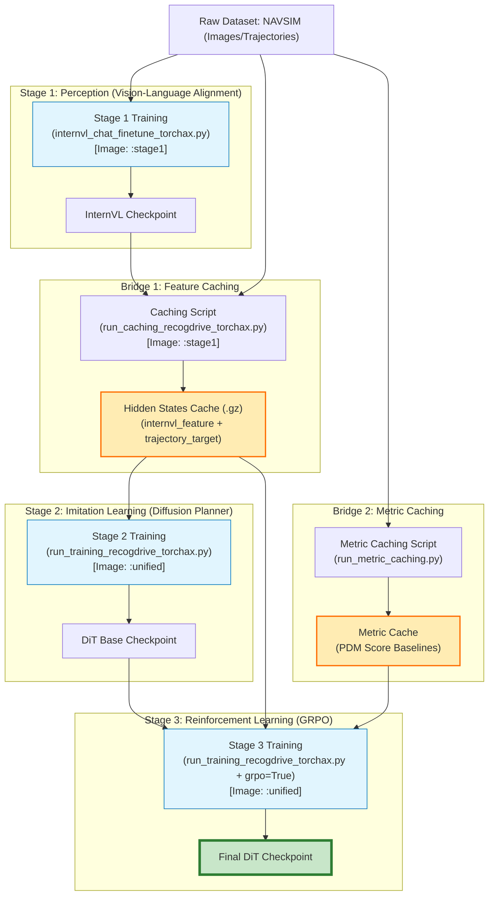

# ReCogDrive TPU Migration: Comprehensive Guide

This document details the complete workflow, environment setup, and commands for running ReCogDrive on Google Cloud TPUs using `torchax` and `JAX`. It covers Stage 1 (Perception), Feature Caching, and Stage 2 (Planning).

## Workflow Overview

The migration involves three distinct phases, bridged by data caching. We utilize two specialized Docker images to handle dependency conflicts between stages.



## Docker Strategy

To resolve version conflicts (specifically `transformers` and `peft` compatibility), we use two Docker images:

1.  **`recogdrive-tpu:stage1`**:
    *   **Purpose**: Stage 1 Training & Feature Caching.
    *   **Key Dependencies**: `transformers==4.37.2`, `peft==0.10.0`, `jax[tpu]==0.6.2`, `torchax`.
    *   **Note**: Requires runtime upgrade of `hydra-core` and `pytest` for Python 3.11 compatibility.

2.  **`recogdrive-tpu:unified`**:
    *   **Purpose**: Stage 2 & Stage 3 Training (Diffusion/RL).
    *   **Key Dependencies**: `transformers==4.43.4`, `peft>=0.18.0`, `diffusers`, `hydra-core>=1.3.2`, `jax[tpu]==0.6.2`, `torchax`.

## Step-by-Step Execution Guide

### 1. Stage 1: Vision-Language Pretraining

**Image**: `recogdrive-tpu:stage1`
**Script**: `internvl_chat/internvl/train/internvl_chat_finetune_torchax.py`

```bash
gcloud alpha compute tpus tpu-vm ssh tpu-v6e-4 \
   --project <PROJECT> --zone <ZONE> --worker=0 \
   --command=\'docker run \
     --privileged --rm --net=host \
     --workdir /recogdrive -v $(pwd)/recogdrive:/recogdrive \
     -e PYTHONPATH=/recogdrive/internvl_chat:$PYTHONPATH \
     us-east5-docker.pkg.dev/grhuang-02/xiaomi-tpu/recogdrive-tpu:stage1 \
     python internvl_chat/internvl/train/internvl_chat_finetune_torchax.py \
    --model_name_or_path \"models/InternVL3-2B\" \
    --conv_style \"internvl2_5\" \
    --output_dir \"work_dirs/stage1_output\" \
    --meta_path \"data/meta.json\" \
    --force_image_size 448 --max_dynamic_patch 1 --down_sample_ratio 0.5 \
    --bf16 True \
    --num_train_epochs 1 --per_device_train_batch_size 1 --gradient_accumulation_steps 1 \
    --learning_rate 4e-5 --weight_decay 0.05 --warmup_ratio 0.0 \
    --logging_steps 1 --max_seq_length 2048 \
    --do_train True --grad_checkpoint False --group_by_length False \
    --dynamic_image_size False --use_thumbnail False --ps_version v2\'
```

*Note: Requires `transformers` hack in script or `bf16=False` if running without GPU detection.*

### 2. Bridge: Feature Caching

**Image**: `recogdrive-tpu:stage1`
**Script**: `navsim/planning/script/run_caching_recogdrive_torchax.py`

This step uses the frozen Stage 1 model to pre-compute features for Stage 2. We apply runtime fixes for `hydra-core`.

```bash
gcloud alpha compute tpus tpu-vm ssh tpu-v6e-4 \
   --project <PROJECT> --zone <ZONE> --worker=0 \
   --command=\'docker run \
     --privileged --rm --net=host \
     --workdir /recogdrive -v $(pwd)/recogdrive:/recogdrive \
     -e PYTHONPATH=/recogdrive:/recogdrive/internvl_chat:$PYTHONPATH \
     -e NAVSIM_EXP_ROOT=/recogdrive/tests/work_dirs \
     -e OPENSCENE_DATA_ROOT=/recogdrive/tests/dummy_data \
     -e NUPLAN_MAPS_ROOT=/recogdrive/tests/dummy_maps \
     -e NUPLAN_MAP_VERSION=nuplan-maps-v1.0 \
     -e HYDRA_FULL_ERROR=1 \
     us-east5-docker.pkg.dev/grhuang-02/xiaomi-tpu/recogdrive-tpu:stage1 \
     /bin/bash -c \"pip install --upgrade hydra-core==1.3.2 omegaconf pytest && \
     python navsim/planning/script/run_caching_recogdrive_torchax.py \
    agent=recogdrive_agent \
    agent.vlm_path=\"models/InternVL3-2B\" \
    agent.vlm_type=\"internvl\" \
    train_test_split=navtrain \
    cache_path=\" /recogdrive/data/cache_output\" \
    experiment_name=caching_job \
    dataloader.params.batch_size=4 \
    dataloader.params.num_workers=0\"\'
```

### 3. Stage 2: Diffusion Planner Training

**Image**: `recogdrive-tpu:unified`
**Script**: `navsim/planning/script/run_training_recogdrive_torchax.py`

```bash
gcloud alpha compute tpus tpu-vm ssh tpu-v6e-4 \
   --project <PROJECT> --zone <ZONE> --worker=0 \
   --command=\'docker run \
     --privileged --rm --net=host \
     --workdir /recogdrive -v $(pwd)/recogdrive:/recogdrive \
     -e PYTHONPATH=/recogdrive:/recogdrive/internvl_chat:$PYTHONPATH \
     -e NAVSIM_EXP_ROOT=/recogdrive/tests/work_dirs \
     -e HYDRA_FULL_ERROR=1 \
     us-east5-docker.pkg.dev/grhuang-02/xiaomi-tpu/recogdrive-tpu:unified \
     python navsim/planning/script/run_training_recogdrive_torchax.py \
    agent=recogdrive_agent \
    agent.lr=1e-4 \
    agent.grpo=False \
    agent.vlm_path=\"models/InternVL3-2B\" \
    agent.cam_type=\"single\" \
    agent.cache_hidden_state=True \
    agent.vlm_type=\"internvl\" \
    agent.dit_type=\"small\" \
    agent.vlm_size=\"small\" \
    agent.sampling_method=\"ddim\" \
    trainer.params.max_epochs=2 \
    experiment_name=stage2_training \
    train_test_split=navtrain \
    cache_path=\" /recogdrive/data/cache_output\" \
    use_cache_without_dataset=True \
    force_cache_computation=False \
    dataloader.params.num_workers=0\'
```

## Technical Fixes Summary

| Component | Issue | Fix |
| :--- | :--- | :--- |
| **JAX/Transformers** | `ConcretizationTypeError` in SDPA | Forced `attn_implementation='eager'`, `_use_sdpa=False`, and `padding_side='right'`. |
| **Data Loading** | `num_samples=0` | Corrected cache directory structure (`token/builder.gz`) and builder unique names. |
| **Model Dims** | `einsum` mismatch (10 vs 8) | Fixed dummy data generation to match model\'s `ego_status` dimension (8). |
| **JAX Gradients** | `TypeError: grad requires real` | Separated trainable params from integer buffers in `train_step`. |
| **Safetensors** | `UntypedStorage` error | Delayed `torchax.enable_globally()` until after model weight loading. |
| **Deadlock** | DataLoader freeze | Set `num_workers=0` and removed `prefetch_factor`. |
```